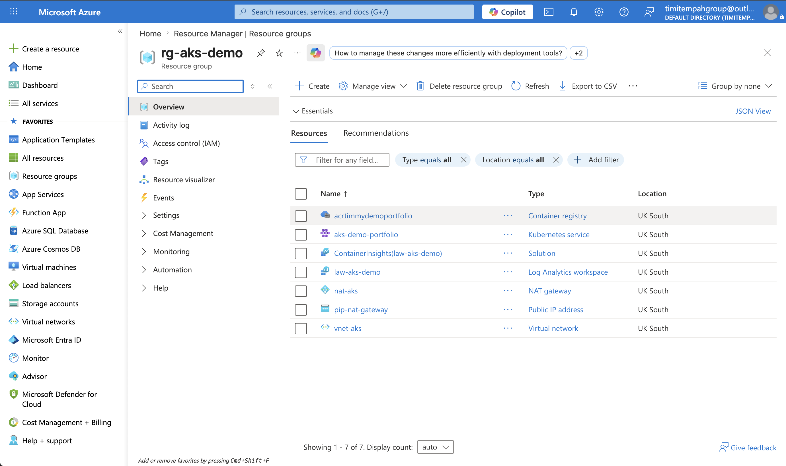
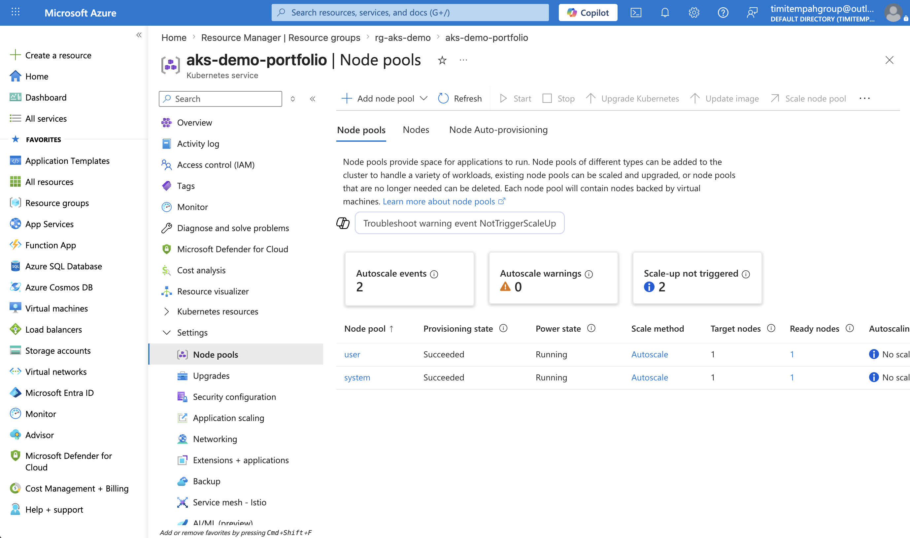
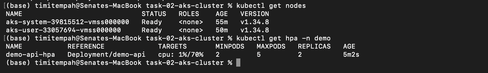
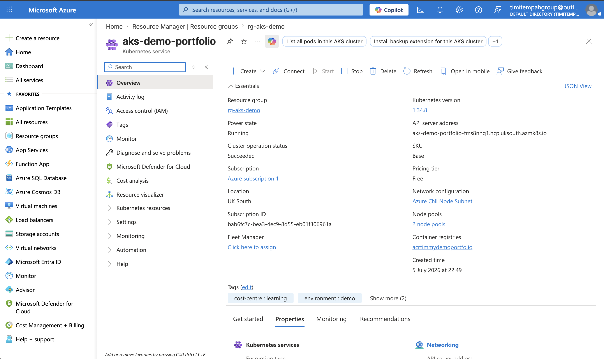

# Task 02 — AKS Production Cluster

## What I Built
A production-grade AKS cluster demonstrating container orchestration
with proper governance, security, and observability — not just a
basic cluster deployment.

## Architecture
- Azure CNI networking — pods get real VNet IP addresses
- NAT Gateway — provides reliable outbound internet access for pods
- Workload Identity — Managed Identity per pod, zero stored credentials
- Entra ID RBAC integration — no local Kubernetes user management
- System node pool (system pods only) separated from user node pool
- Cluster Autoscaler configured on both pools
- Container Insights feeding Log Analytics for full observability
- AcrPull role assignment — credential-free image pulls from ACR

## Key Design Decisions
Resource requests and limits set on every deployment — without them
the Cluster Autoscaler has no signal to scale nodes. HPA scales pods
based on CPU utilisation. Cluster Autoscaler scales nodes based on
pending pods. Both are required together.

NAT Gateway added to resolve SNAT exhaustion — Azure CNI pods need
a dedicated outbound path to pull images from external registries.

## Skills Demonstrated
AKS | Azure CNI | NAT Gateway | Workload Identity | Entra ID RBAC |
Cluster Autoscaler | HPA | Container Insights | Terraform | Kubernetes
