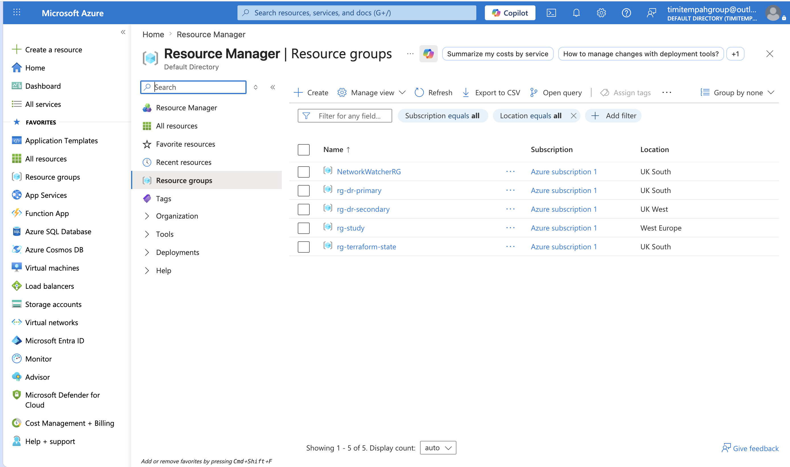
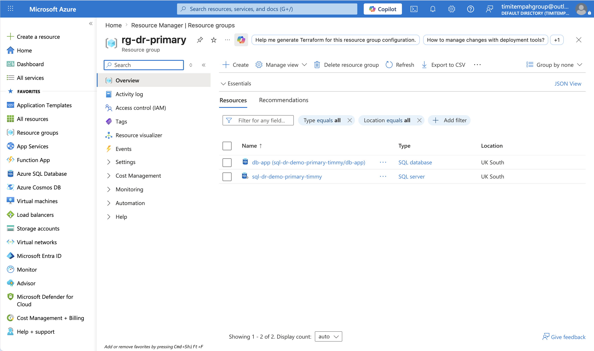
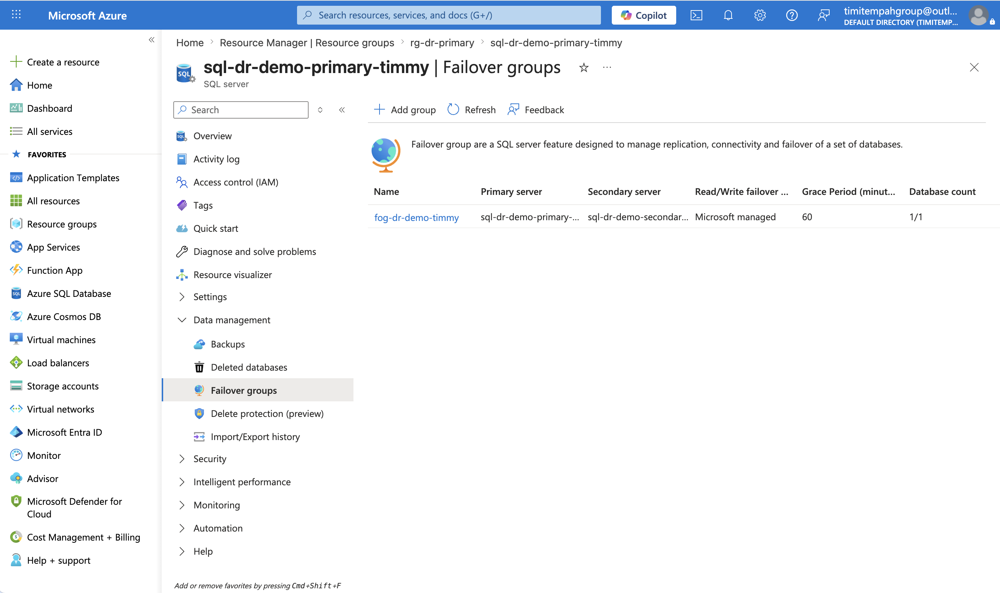

# Task 03 — Disaster Recovery Architecture

## What I Built
A multi-region disaster recovery setup demonstrating RTO/RPO-driven
architecture — primary Azure SQL Database in UK South with automatic
geo-replication and failover to UK West.

## Architecture
- Primary Azure SQL Server and Database in UK South
- Secondary Azure SQL Server in UK West with Active Geo-Replication
- SQL Failover Group with Automatic failover policy (60 min grace period)
- Data replicated continuously from UK South to UK West

## Key Design Decisions
RTO and RPO targets are agreed with the business before any technical
design begins. The architecture is built to meet those numbers, not
the other way around.

The 60-minute grace period on the failover policy prevents Azure from
failing over on a short transient blip — it only triggers after a
genuine sustained outage, which protects against unnecessary failovers.

## Production Note
In a production deployment this architecture would also include:
- An App Service in UK South as the primary application endpoint
- A secondary App Service in UK West as the DR endpoint
- Azure Traffic Manager with Priority routing for automatic DNS-based
  regional failover
- These were omitted from this deployment due to subscription VM quota
  constraints — the SQL Failover Group demonstrates the core DR pattern

## DR Runbook Summary
- RTO Target: 45 minutes
- RPO Target: 15 minutes
- Failover command: az sql failover-group set-primary

## Skills Demonstrated
Multi-Region Architecture | SQL Geo-Replication | Failover Groups |
RTO/RPO Design | Disaster Recovery Planning | Terraform
