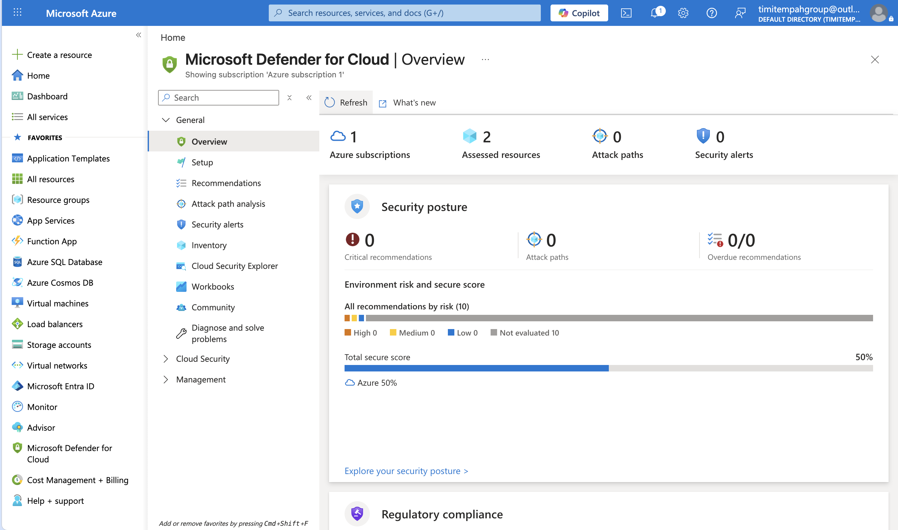

# Task 07 — Security Posture Baseline

## What I Built
Defender for Cloud enabled across key resource types with a documented
remediation decision captured as an Architecture Decision Record.

## Secure Score
Current score: 50% (6/12) with 10 active recommendations.
Defender for Cloud plans enabled: VirtualMachines, SqlServers,
StorageAccounts — all on Standard tier.

## Why This Matters
Security posture is continuous, not a one-time setup. Documenting
remediation decisions as ADRs creates a record of reasoning that
survives staff turnover and supports audit requirements. The ADR
format captures not just what was decided but why — including the
options that were considered and rejected.

## ADR Summary
ADR-001 documents the decision to implement MFA via Conditional
Access Policy rather than Security Defaults — chosen because it
allows break-glass account exclusions while enforcing MFA for all
standard users.

## Skills Demonstrated
Defender for Cloud | Secure Score | Security Recommendations |
Architecture Decision Records | Conditional Access | MFA | Azure CLI
