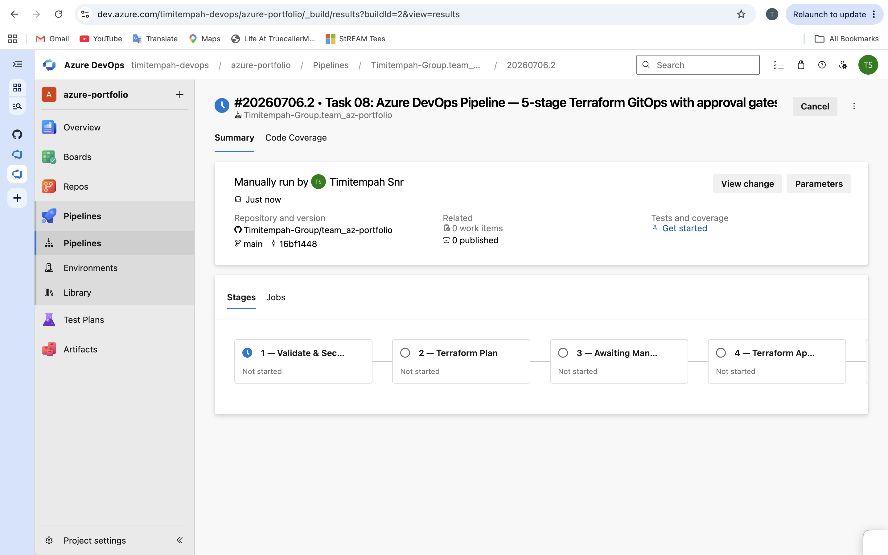
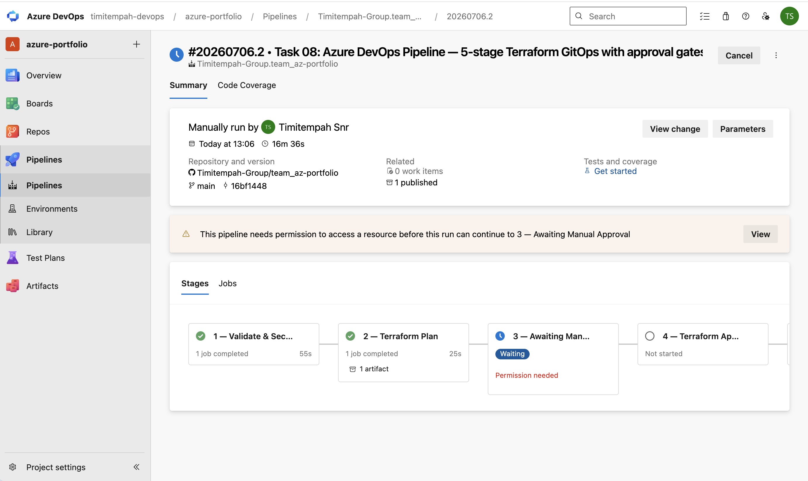
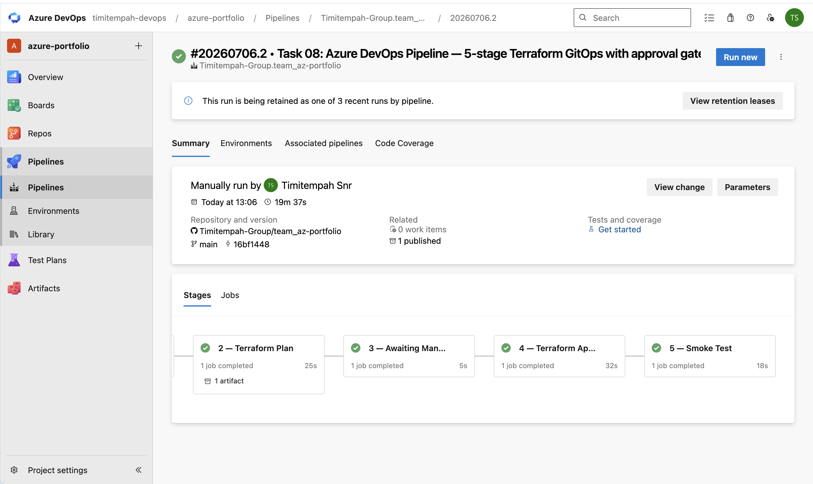

# Task 08 — Azure DevOps Pipeline for Terraform

## What I Built
A 5-stage Azure DevOps YAML pipeline for Terraform infrastructure
delivery with security scanning, manual approval gates, and
post-deployment smoke testing.

## Pipeline Stages
1. Validate — terraform fmt, validate, tfsec, Checkov
2. Plan — terraform plan saved as pipeline artifact
3. Approval — manual gate: pipeline pauses until approved
4. Apply — terraform apply using the saved plan
5. Smoke Test — Azure CLI verifies the deployment exists

## Key Design Decisions
Workload Identity Federation — no client secrets stored anywhere.
Variable Groups keep sensitive config in Azure DevOps Library not YAML.
The production Environment requires explicit human sign-off before apply.
The saved plan artifact ensures exactly what was approved gets deployed.

## Skills Demonstrated
Azure DevOps | YAML Pipelines | Terraform | tfsec | Checkov |
Approval Gates | Workload Identity Federation | GitOps
